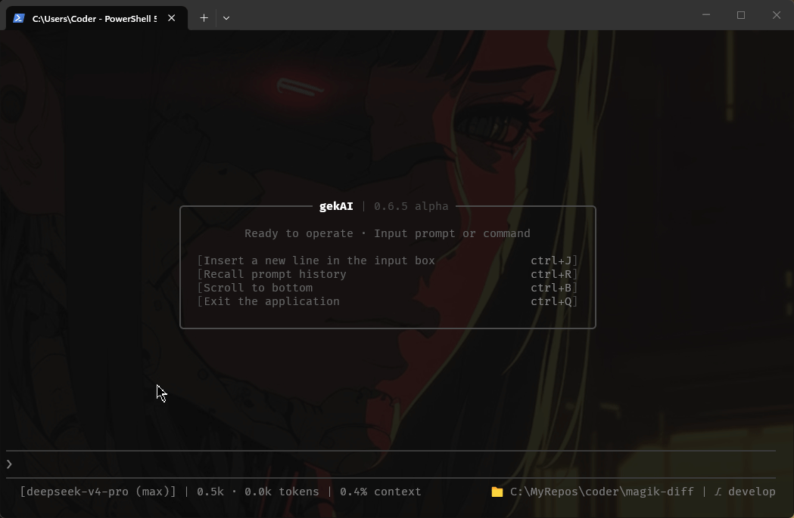

# Gekai

A precision-scoped AI coding agent built around frequent human validation, not long autonomous runs. Every turn produces something you look at before the next one starts — the harness never runs away with your codebase while you're not watching.

> Pre-sharing of an in-progress codebase. Expect rough edges and breaking changes with no notice. Pull requests are not accepted and issues may not be reviewed for now — for any communication, write directly to the author.



## Concept

Most agent frameworks bet everything on the model: give it more tools, more autonomy, more turns, and hope a stronger model makes up the difference. Gekai bets on the harness instead — the engineered, non-LLM machinery around the model (routing, file location, permission gates, verification, event/diff output). A well-built harness lets a smaller, cheaper model produce results comparable to a stronger model used without one. If that bet holds, the ceiling on what's achievable stops being "which model can you afford" and becomes "how good is the harness around it."

A few decisions follow from that:

- **One agent, many borrowed roles.** There's exactly one long-lived identity — `main` — that you always talk to. A "subagent" isn't a separate process handed off to a stranger; it's a scoped role the same system plays for a single turn, with its own restricted tools and permissions, then discards. Nothing fragments across a fleet of independent actors.
- **Routing is a guard, not a classifier.** A cheap, non-thinking model call classifies each turn onto an ordinal scale — `CHAT ⊂ SOLO ⊂ MUTATE` — deciding how much machinery the turn deserves, never which specialist should handle it. Only genuinely implementation-sized work reaches a planner that decomposes it into a task graph; a bare "hi" never spawns anything.
- **Surgical means correct, not small.** A one-line edit in the wrong place is worse than a mechanical rename across fifty files. The safety property that matters is verification of the change itself, not how little it touched.
- **Checkpoint-oriented, not autonomous.** Subagents run cold, fire-and-forget, per turn — no carried context, no background operation. A task graph can chain several steps in one turn, but there's no interactive approval gate, no revert-on-failure, and no resuming a halted run days later. It's built for "watch it work in small verifiable increments," not "give it a task and come back tomorrow."

See [`docs/concepts.md`](docs/concepts.md) for the full reasoning behind these choices, and [`docs/architecture.md`](docs/architecture.md) for how they're actually wired up.

## Layers

- `agent/pipeline` — Router, FileLocator, blast-radius gate, PromptRewriter (the per-turn pipeline)
- `agent/harness` and `agent/subagents` — the tool-calling loop and its specialist delegation
- `agent/llm` — vendored provider adapter (retries, events, model caps)
- `agent/tools` — tool catalog and implementations (files, shell)
- `agent/workspace` — scanning, ignore rules, manifest parsing, symbol indexing
- `agent/tui` — Textual UI
- `agent/commands` — slash-command handling

## Subagents

Auto-assignable specialists a task graph can dispatch to, each also reachable directly via its own slash alias:

| Alias | Specialist | Scope |
| --- | --- | --- |
| `/build` | code-expert | features and decided implementation swaps |
| `/fix` | code-fixer | diagnose a failure, apply the minimal correction |
| `/refactor` | code-refactorer | extract, rename, dedup — no behavior change |
| `/simplify` | complexity-remover | prune dead code, unjustified layers, speculative flexibility |
| `/build-test` | test-expert | write spec-driven test suites or coverage designs |
| `/fix-test` | test-fixer | realign failing tests to current implementation |

An explicit alias bypasses routing and planning entirely — the whole turn runs as that specialist's identity.

## Requirements

- Python 3.11+
- An OpenAI-compatible endpoint for the model calls (any provider, no SDK lock-in)

## Install & run

```sh
pip install -e .
gekai                    # launch the TUI in the current directory
gekai -d path/to/repo    # launch in a specific working directory
gekai -r SESSION_ID      # resume a previous session
```

## License

MIT © [koder0x](https://github.com/gsscoder)
