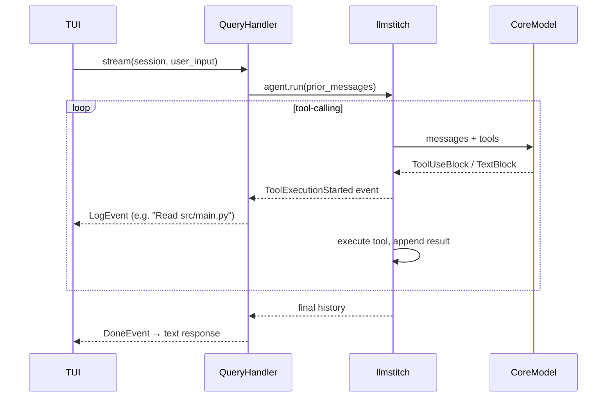

# Prompting Architecture

## Overview

Every turn passes through three layers: **normalization → classification → handler dispatch**.
Each layer uses a distinct prompt and may use a distinct model (**support** vs. **core**).

```
user input
    │
    ▼
PromptNormalizer          [support model]  — translate / normalize; detect source language
    │
    ▼
IntentClassifier          [support model]  — decompose into labeled segments
    │
    ▼
Handler(s)                [core model]     — chat / query / action / memorize
```

---

## Session Message Structure

`Session.messages` is the live context passed to the core model each turn.

```
index  role      content
─────────────────────────────────────────────────────────
  0    system    SYSTEM_PROMPT
  1    system    <workspace> block  (TOON-encoded, injected fresh on startup)
  …    user      prior turns
  …    assistant prior turns
  …    system    [preference] …    (memorize segments only)
  N    user      current input      (appended before dispatch)
  N+1  assistant response           (appended after all segments complete)
```

**System messages** (`[0]`, `[1]`, preference entries) are excluded from persistence;
they are re-injected fresh on every startup or resume.

---

## SYSTEM_PROMPT Blocks

```
SYSTEM_PROMPT
├── preamble          identity + capability statement
├── meta-rule         "follow user instructions literally"
├── <behavior>        focus, precision, no fabrication
├── <response_style>  terse when explaining; fragments OK; no filler
└── <file_handling>   show/print/display → full verbatim fenced block
```

`QueryHandler` appends `_TOOL_INSTRUCTION` at construction time:

```
system = SYSTEM_PROMPT + "\n\n" + _TOOL_INSTRUCTION
```

`_TOOL_INSTRUCTION` tells the model **when `<workspace>` metadata is sufficient**
vs. **when tools are mandatory** (file contents, logic, depth).

---

## Intent Classification

`IntentClassifier.classify(user_input, history=None)` makes **one LLM call**.
Returns `list[tuple[Intent, str]]` — `(intent, sub-prompt)`.

**History context:** last 6 user/assistant turns prepended before the user message.

```
CLASSIFIER_PROMPT
├── output format     label: text  (one line per segment)
├── <labels>          chat | query | action | memorize | clarify
├── <rules>           preference order
└── <examples>        few-shot
```

Fallback on parse failure: `[(Intent.CHAT, user_input)]`.

### Routing table

| Intent     | Handler        | Notes                              |
|------------|----------------|------------------------------------|
| `chat`     | ChatHandler    | knowledge only, no tools           |
| `query`    | QueryHandler   | tool-calling loop via llmstitch    |
| `action`   | ActionHandler  | modifies repo files                |
| `memorize` | —              | appends system message to session  |
| `clarify`  | ChatHandler    | model decides with full context    |

---

## QueryHandler — Tool Loop

Uses `llmstitch.Agent` with `OpenAIAdapter`; tools registered from `make_tools(working_dir)`.



Events flow through `EventBus` → async queue → TUI stream.

---

## WsExplorer SubAgent

`WsExplorer` (`ws_explorer/subagent.py`) is a `SubAgent` that **enriches workspace metadata**.
It streams `SubAgentEvent` instances to the TUI for live progress display.

### Activation

- **Startup**
- **`/workspace:rebuild`**

`.gekai/` directory excluded from activation triggers.

### Scan phases (`scan_workspace` → `.gekai/workspace.json`)

```
1. repo name (git remote) + branch
2. manifest scan  →  projects[]  (lang + path; skip hidden/vendor)
3. extension frequency  →  extensions{}  (top 15; fallback when no manifests)
4. AI instruction file detection  (root + one level deep)
```

**Cache reuse:** `< 15 min` fresh session · `< 30 min` resume. `created_at` preserved across re-scans.

### Enrichment (`enrich_workspace`)

**Two parallel** support-model calls:

```
┌─────────────────┐     ┌──────────────────┐
│   proj_brief    │     │   domain_map     │
│  (summary +     │     │  (feature areas  │
│   tech stack)   │     │   → file paths)  │
└─────────────────┘     └──────────────────┘
         └──────────────────┘
                 ▼
         workspace.json  (merged)
                 ▼
         injected into Session.messages[1]
         as <workspace> block
```

Async callbacks fired during enrichment: `on_file` · `on_infer_start` · `on_infer_delta` · `on_infer_end`.

### Injected workspace fields

**Always:** `workspace_name`, `workspace_type`, `branch`, `primary_languages`, `projects`
**Conditional:** `extensions` (when `projects` empty) · `domain_map` (when present)
**Preamble:** `"verified repository metadata — treat as authoritative for high-level questions:"`
